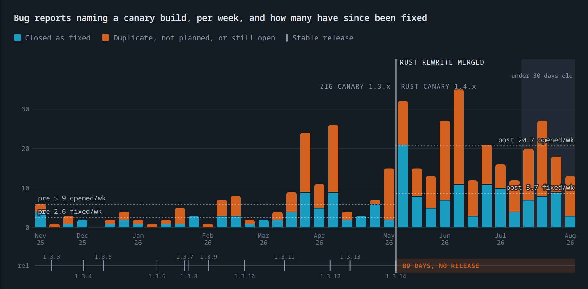

# One PR, a million lines of Rust — what it did to Bun's bug reports

A study of [oven-sh/bun#30412](https://github.com/oven-sh/bun/pull/30412), which replaced Bun's
Zig runtime with a Rust one in a single merge, and what it did to the project's defect reports.



[Full report](https://asmyshlyaev177.github.io/bun-rust-rewrite-analysis/)

| | |
| --- | --- |
| **The rewrite** | [PR #30412](https://github.com/oven-sh/bun/pull/30412) — "Rewrite Bun in Rust" |
| **Opened → merged** | 2026-05-08 → **2026-05-14 08:09 UTC** (6 days) |
| **Diff** | +1,009,257 / −4,024 across 2,188 files, 6,755 commits |
| **Branch** | `claude/phase-a-port` |
| **Window studied** | 2025-11-13 → 2026-08-10 (26 weeks before, 12 full weeks + 5 days after) |
| **Corpus** | 2,981 issues · 2,629 bug reports · 402 identifiably canary · 214 releases · 2,772 merged PRs |
| **Data pulled** | 2026-08-10 |
| **Interactive version** | `index.html` (self-contained, open in any browser) |

---

## Headline findings

**On the canary channel — the only place the Rust code shipped — bug reports rose 2.2–3.5×, while the
share of them that gets fixed did not move.**

| Canary channel | Zig (26 wks before) | Rust (12 wks after) | Change |
| --- | ---: | ---: | --- |
| Bug reports / week | 5.92 | **20.67** | ×3.49 (×2.20 vs the final quarter) |
| Fix rate (ever closed as fixed) | 43.5% | **41.9%** | −1.6 pt |
| Fixed / week | 2.58 | 8.67 | ×3.36 |
| Fixed within 30 days | 18.8% | **30.4%** | +11.6 pt |

**On stable 1.3.x — code that has not changed since 13 May — reports fell by a third.**

| Stable 1.3.x only | Before | After | Change |
| --- | ---: | ---: | --- |
| Bug reports / week | 45.77 | **31.50** | −31.2% |
| Fix rate | 42.6% | 39.2% | −3.4 pt |

**The repo-wide total is motionless, and is the least informative number here** — 69.31 bug reports/week
before, 68.92 after (−0.6%). It holds still because canary rose by 14.8/week while stable fell by 14.3.
Any analysis that stops at the repo total will conclude nothing happened.

**Nothing has shipped to stable.** The newest stable tag is `bun-v1.3.14`, released 2026-05-13 — one day
*before* the rewrite merged. Zero releases in the 88 days since; the longest gap between any two Bun
releases in all of 2024–2026 was 27 days, against a median of 8.

---

## What was merged

**Scale.** Opened 8 May 2026, merged on the 14th. A 1,009,257-line addition against 4,024 deletions
across 2,188 files and 6,755 commits — the runtime rewritten in a different language, landing in one
merge rather than incrementally.

**Authorship — confirmed, not inferred.** The branch is `claude/phase-a-port`, matching the repository's
standing convention for AI-assisted branches (7,469 of its 18,528 pull requests carry a `claude` label).
[Sumner's retrospective](https://bun.com/blog/bun-in-rust) (8 Jul 2026) states the port ran as **~50
parallel Claude Code workflows** on a pre-release Claude model; [The Register](https://www.theregister.com/devops/2026/07/14/zig-creator-calls-buns-claude-rust-rewrite-unreviewed-slop/5270743)
reports **11 days end-to-end, ~$165,000 at API pricing**, a peak near 1,300 lines/minute, and 100% of the
test suite passing — against Sumner's estimate that a human rewrite "would take a small team of engineers
a full year." Disclosures that cut both ways: **Anthropic acquired Bun in December 2025**, and this study
was itself researched and written with Claude.

**Throughput.** Merged pull requests went from 45.7/week in the six months before to 126.1/week after
(×2.76). The AI-labelled share rose from 55.5% to 75.0%. The rewrite changed the development mode, not
just the language.

**The author's own note, on the day it merged:**

> It passes Bun's pre-existing test suite on all platforms … the binary size shrinks by 3 MB – 8 MB, the
> benchmarks are between neutral and faster … To try this, run `bun upgrade --canary`. **Please do file
> issues if you run into any.** … Still some optimization work to do before this lands in non-canary version.

Three things in that note shape everything below: the Rust build shipped to **canary only**, stable was
**explicitly deferred**, and users were **asked** to file issues — which is itself a reason canary
reports would rise.

---

## Method

**Source.** All 2,981 issues (pull requests excluded by construction) created in `oven-sh/bun` between
2025-11-13 and 2026-08-10, pulled via the GitHub GraphQL API with `createdAt`, `closedAt`, `state`,
`stateReason`, labels, author and body text. Releases from the Releases API — all 214 are marked
non-prerelease. Totals cross-checked against the Search API.

**Binning.** Weeks are 7×86400-second bins anchored to the merge timestamp rather than to calendar
weeks, so week −1 is the last seven days before the rewrite and week 0 the first seven after. Week −26
begins 2025-11-13, six months before the merge. Week +12 covers five days and is excluded from every
average.

**What counts as a bug report.** Every issue *not* labelled `enhancement`, `docs`, `idea`, `question`,
`chore`, `duplicate`, `invalid` or `wontfix` — 1,802 before and 827 after. Whether an issue was triaged
is irrelevant; only that it was opened.

The `bug` label is deliberately **not** used as the definition. Label coverage collapsed across the cut:
the unlabelled share of new issues went from 0–3% in November 2025 to 49.8% after the rewrite (56.4% in
the final month), and `needs triage` tracks the `bug` label almost exactly week for week because the two
are applied in the same pass. A `bug`-label count measures triage effort, not defect reports — it would
show −39% (52.3 → 31.8/week) where the real movement is roughly −1% to −6%.

**The bias this definition carries.** Filtering by label can only remove what triage caught, so as
labelling declines more unlabelled feature requests survive into the bug count. Labelled non-bugs were
12.4% of issues before and 6.9% after; holding that share constant puts the post-rewrite bug rate at
64.8/week rather than 68.9 — i.e. −6.5% rather than −0.6%, the same figure you get from counting all
issues with no exclusions (79.1 → 74.0). The truth sits between the two; neither is far from flat.

**Which build a report is about.** Classified from version strings in the title and body — Bun's issue
template asks for `bun --revision`, so most reports carry one.

| Class | Rule | Pre | Post |
| --- | --- | ---: | ---: |
| **Canary** | text matches `1.3.x-canary` (Zig canary) or `1.4.x` (Rust line, never stable-released) | 154 (8.4%) | 248 (29.7%) |
| **Stable only** | matches `1.3.x` with no canary suffix and no `1.4.x` mention | 1,190 (66.2%) | 378 (45.9%) |
| **No version stated** | neither | 458 (25.4%) | 201 (24.3%) |

The unclassified share barely moves across the cut, so the split is not an artifact of reporting habits
changing.

**The canary lineage switches cleanly at the merge**, which is what makes it a usable natural experiment:

| | Pre-merge | Post-merge |
| --- | ---: | ---: |
| `1.3.x-canary` (Zig) | 145 | 25 |
| `1.4.x` (Rust) | 9* | 223 |

\* All nine pre-merge `1.4.x` matches are false positives — library versions (elysia 1.4.x,
tw-animate-css 1.4.0, cookie-parser 1.4.7, WCAG criterion 1.4.3, duckdb 1.4.4, libavif 1.4.2), inspected
individually. **Not a single pre-merge issue names a 1.4.x Bun build**, and `1.3.x-canary` mentions stop
within a week after the merge. The handover is exact.

**Classifier robustness.** A stricter rule — a `1.4.x` token only counts if it carries
canary/debug/a build hash, or sits within 80 characters of bun/version/revision — moves the counts from
154→147 pre and 248→246 post, leaves both fix rates unchanged to one decimal, and *raises* the volume
ratio from ×3.49 to ×3.63. The published looser rule is the conservative choice. In a 25-issue random
sample of post-rewrite canary classifications, 23 were the reporter's own `bun --revision` output; the 2
misses were library versions. Reproduce with `scripts/10-classifier-robustness.py`.

**What counts as fixed.** GitHub's `stateReason` of `COMPLETED` on a closed issue — what maintainers
signal when they close something as resolved rather than as a duplicate or as not planned. The 19 issues
closed and later reopened count as **open**, not fixed. Headline fix rates compare final states as of the
pull date, which penalises the younger cohort; the 30-day figures ask the same question of every week —
what share was fixed within 30 days — over weeks old enough to answer it.

---

## Finding 1 — the canary channel

Both sides of the cut are the same distribution channel and roughly the same kind of user: people who
deliberately run pre-release Bun. The only thing that changes is the language the runtime is written in,
because the Rust port went straight into canary and has never left it.

Through that channel, bug reports went from **5.9 a week to 20.7** — ×3.5 against the full pre-window, or
**×2.2** against the busier final quarter before the merge, which is the conservative read. Fixes kept
pace: **41.9%** of Rust-canary reports have been closed as fixed against **43.5%** of Zig-canary ones, and
8.7 a week are now being fixed against 2.6 before. The share fixed within 30 days *improved*, from 18.8%
to 30.4% — Zig canary was a side branch where reports could sit for months; Rust canary is the mainline.

**What this cannot separate is how many people are reporting.** Two things changed at the cut besides the
language: canary became the only way to get the Rust build, and the PR asked for reports in as many
words. Report volume is exposure × defect density × willingness to report, and only the product is
observable. **The ×2.2–3.5 rise is an upper bound on any rise in defect density, not a measurement of it.**

The ratios are the sturdier half of the finding. Fix rate and fix latency don't depend on how many people
are looking, and both say the team is clearing what canary throws at it at the rate it always did — while
merging 126 pull requests a week against 46 before.

## Finding 2 — the two populations diverge

Canary reports rose by 14.8 a week; reports naming only a stable 1.3.x build fell by 14.3. Bun did not
stop receiving bugs at the old rate; it stopped receiving them about the same code.

The stable side is the natural control group. Nothing in `1.3.14` changed after 13 May — it is the same
Zig binary every stable user is still running — and reports about it fell **31.2%**, with the fix rate
slipping from 42.6% to 39.2%. That is what a codebase looks like when the people who maintain it have
moved to something else.

## Finding 3 — the release drought

| | Before | After |
| --- | --- | --- |
| Releases | 12 in 182 days (**2.01/month**, median gap 16 days), v1.3.3 → v1.3.14 | **0 in 88 days** |
| Context | The same calendar window a year earlier shipped **25 releases** at a 5-day median gap | Longest gap in all of 2024–2026 was **27 days**, median 8 |

The newest stable tag, `bun-v1.3.14`, landed 2026-05-13 — one day before the rewrite merged. The current
gap is 89 days and open-ended.

The consequence is that the user base is split in two: everyone on stable is running Zig code that is no
longer being actively fixed, and everyone on canary is running Rust code that cannot be installed by
default. On the evidence here the rewrite's measurable cost so far is not a defect spike — it is that the
two halves of the user base have been on different runtimes for three months, exactly as the PR said they
would be until the optimization work lands.

---

## Discussion — the debate this case lands in

The hypothesis this study set out against: *Rust's whole-language rigidity and complexity — borrow
checker, lifetimes, trait system, syntax, static types included — make it badly suited to everyday
development, where tasks are rarely precisely defined and unexpected cases demand flexibility.* That
position is neither fringe nor strawman: it is held by senior practitioners with serious Rust mileage, by
the designers of Go and of Zig — the language Bun left — and, in part, by Rust's own creator. The
production record at scale points the other way. Every quote below was fetched from its source and
verified on 2026-08-10 (raw findings in `data/opinions.json`).

### The case that rigidity hurts

- **[LogLog Games](https://loglog.games/blog/leaving-rust-gamedev/)** (3+ yrs full-time Rust, 100k+
  lines, shipped games, 2024): "…the borrow checker *forces* a refactor at the most inconvenient times."
  A section title in the same essay: "Making a fun & interesting games is about rapid prototyping and
  iteration, Rust's values are everything but that."
- **[John Nagle](https://news.ycombinator.com/item?id=40172952)** (five decades of systems engineering;
  ~45k lines of safe Rust on a metaverse client): "He's right about the pain of refactoring and the
  difficulties of interconnecting different parts of the program. It's quite common for some change to
  require extensive plumbing work." — adding that the C#/Unity teams on the same problem move faster.
- **[Brandon Reinhart](https://deadmoney.gg/news/articles/migrating-away-from-rust)** (25+ yrs: Epic,
  3D Realms, Valve): after ~14 months on Rust/Bevy, rewrote the studio's game in Unity/C# in ~6 weeks —
  "my motivation to build and ship fun gameplay was stronger than my desire to build with Rust."
- **[Graydon Hoare](https://graydon2.dreamwidth.org/307291.html)**, Rust's creator, "The Rust I Wanted
  Had No Future" (2023, paraphrased — the post resists automated fetching): shipped Rust is far from the
  language he wanted; he argued against explicit lifetimes, first-class borrows and the trait system as
  costing more cognition than they return, while conceding his simpler Rust "had no future."
- **Rob Pike** (co-creator of Go and Plan 9), Go's design rationale
  ([as quoted](https://bravenewgeek.com/go-is-unapologetically-flawed-heres-why-we-use-it/)): "The key
  point here is our programmers are Googlers, they're not researchers… They're not capable of
  understanding a brilliant language but we want to use them to build good software." His
  ["Less is exponentially more"](https://commandcenter.blogspot.com/2012/06/less-is-exponentially-more.html)
  (2012) treats feature-count as the disease, not the cure.
- **[Zig's official design rationale](https://ziglang.org/learn/why_zig_rust_d_cpp/)** — the philosophy
  of the language Bun walked away from — names Rust's feature volume directly: "One finds oneself
  debugging one's knowledge of the programming language instead of debugging the application itself."
- **[Rust's own 2023 survey](https://blog.rust-lang.org/2024/02/19/2023-Rust-Annual-Survey-2023-results/)**:
  the top worry for the language's future was "Rust becoming too complex" — **43%** of 9,374 respondents,
  up 5 points on the year, still top-of-list in 2024. The complexity worry is loudest among Rust's own users.
- Insider testimony rounds it out: **[Brian Anderson](https://www.pingcap.com/blog/rust-compilation-model-calamity/)**
  (Rust co-founder) — "Rust compile times are so, so bad"; **[withoutboats](https://without.boats/blog/why-async-rust/)**
  (async Rust's designer) — needing to pin a future trait object to await it "was an unforced error";
  **[Matt Kline](https://bitbashing.io/async-rust.html)** — "Used pervasively, Arc gives you the world's
  worst garbage collector"; **[Armin Ronacher](https://lucumr.pocoo.org/2022/1/30/unsafe-rust/)** —
  unsafe Rust is harder than the C it replaces.

### The case that rigidity pays

- **[Google, Android (Nov 2025)](https://blog.google/security/rust-in-android-move-fast-fix-things/)** —
  production data at one of the largest codebases in existence: "For medium and large changes, the
  rollback rate of Rust changes in Android is ~4x lower than C++." Rust changes spend ~25% less time in
  review, need ~20% fewer revisions, and show "a 1000x reduction in memory safety vulnerability density"
  vs Android's C/C++; memory-safety vulnerabilities fell below 20% of Android's total for the first time
  (from 76% in 2019).
- **[Lars Bergstrom](https://www.theregister.com/2024/03/31/rust_google_c/)** (Google engineering
  director, ex-Servo lead): "In every case we've seen a decrease by more than 2x in the amount of effort
  required to both build the services in Rust as well as maintain and update those services…" Google's
  [survey of 1,000+ of its Rust developers](https://opensource.googleblog.com/2023/06/rust-fact-vs-fiction-5-insights-from-googles-rust-journey-2022.html)
  found **no productivity penalty** vs their prior language, most reaching parity within four months.
- **[Dropbox](https://dropbox.tech/infrastructure/rewriting-the-heart-of-our-sync-engine)** — who chose
  Rust precisely for their most edge-case-ridden component, against a state space they call
  "astronomical": "Rust has been a force multiplier for our team, and betting on Rust was one of the best
  decisions we made. More than performance, its ergonomics and focus on correctness has helped us tame
  sync's complexity."
- **[Catherine West](https://kyren.github.io/2018/09/14/rustconf-talk.html)** (Starbound's lead
  programmer, RustConf 2018 keynote — from inside gamedev): "Rust, by design, makes certain programming
  patterns more painful than others. This is a GOOD thing!"
- **[Bryan Cantrill](http://bcantrill.dtrace.org/2020/10/11/rust-after-the-honeymoon/)** (DTrace
  co-inventor, ~30 years of production C): "Rust's ubiquitous Option type allows for sentinel values to
  be eliminated from one's code – and with it some significant fraction of defects."

### The boundary both camps agree on

The fiercest critique concedes it: "Rust fits very nicely in the low level algorithmic areas where one
knows exactly what the problem is and just needs to solve it" (LogLog Games, the same essay). An ex-AAA
engine developer [in the same thread](https://news.ycombinator.com/item?id=40177569): "Rust excels when
you know what you want to build… Once you get up in game logic/behavior that iteration loop is so dynamic
that you are prototyping more than developing."

The disagreement is not really about Rust. It is about which regime the work lives in. The complexity tax
is **front-loaded** — paid during exploration, while requirements churn. The strictness dividend is
**back-loaded** — collected in production, as defect classes that never ship. Which side of the ledger
dominates depends on how much of the work is exploration and how much is execution against a known spec.

Two scope notes keep this honest. **Zig is also a statically-typed, compiled language** — this case
measures the increment of ownership, lifetimes and traits, not "static vs dynamic typing," and the
static-typing literature was researched and deliberately excluded as a different question. And a
JavaScript runtime that embeds JavaScriptCore over FFI keeps a substantial `unsafe` surface where the
borrow checker's guarantees lapse — "use-after-free becomes a compile error" is a property of safe Rust,
not of the FFI boundary where much of a runtime's hottest code lives.

---

## The AI variable

The rigidity argument has always been an argument about *human* iteration speed — the cost of fighting
the compiler while exploring. This rewrite changes who does the fighting. Per
[Sumner's retrospective](https://bun.com/blog/bun-in-rust) and
[press reporting](https://www.theregister.com/devops/2026/07/14/zig-creator-calls-buns-claude-rust-rewrite-unreviewed-slop/5270743):
~50 parallel Claude Code workflows on a pre-release Claude model, 11 days end-to-end, ~$165,000 at API
pricing, a peak near 1,300 lines a minute, 100% of the test suite passing — against his estimate of
"a small team of engineers a full year."

- **[Jarred Sumner](https://bun.com/blog/bun-in-rust)** — the rewrite's thesis: "A large percentage of
  bugs from that list are use-after-free, double-free, and 'forgot to free' in an error path. In safe
  Rust, these are compiler errors… **Compiler errors are a better feedback loop than a style guide.**"
- **[Simon Willison](https://simonwillison.net/2026/Jul/8/rewriting-bun-in-rust/)** (~25 yrs, Django
  co-creator) judges the port a success but credits the *verification harness*, not the language: "A
  language-independent test suite with a million assertions, adversarial code review and when something
  does go wrong, fixing the process that generates the code instead of hand-fixing the code."
- **[Armin Ronacher](https://lucumr.pocoo.org/2025/8/4/shitty-types/)** — the credible dissent, from a
  long-time production Rust user: "If you do put the type check into the loop, my tests actually showed
  worse performance." His agent experiments favor loose, "best-effort" typing, and he
  [recommends Go, not Rust](https://lucumr.pocoo.org/2025/6/12/agentic-coding/), for agentic coding.
- **[Andrew Kelley](https://andrewkelley.me/post/my-thoughts-bun-rust-rewrite.html)** (Zig's creator)
  rejects the language framing outright: "The main issue here had nothing to do with the language
  features of Zig vs Rust, and everything to do with the diverging value systems of the two projects and
  the relationship breakdown that followed." And on verification: "It's not sufficient to catch bugs in
  Zig code but it is sufficient to catch bugs in [a] million lines of unreviewed slop?"

The peer-reviewed evidence leans Sumner's way on the narrow question: constraining LLM decoding with
type-system rules [cuts compilation errors by more than half](https://arxiv.org/abs/2504.09246)
(ETH Zürich / UC Berkeley, PLDI 2025), and an LLM iterating against `rustc`'s error messages
[fixes ~74% of real-world compile errors unaided](https://arxiv.org/abs/2308.05177) (Microsoft Research,
ICSE 2025). In an agent loop, the strict compiler converges instead of blocking. Against that stand
Ronacher's hands-on results — and Kelley's objection, which is not about Rust at all: compilation proves
the absence of certain bug classes, not the presence of understanding. Nobody has read the million lines.

This study's numbers adjudicate a little of both. The language did not become the bottleneck — bug-fix
throughput held at pre-rewrite rates against triple the canary report volume, at 2.76× the merge rate.
The *human* loop did: triage collapsed and nothing has shipped to stable in 89 days. Machines absorbed
the complexity tax. Humans kept the verification bill.

---

## Conclusions

1. **On its own numbers, the rewrite was neither catastrophe nor triumph.** Canary bug reports rose
   ×2.2–3.5 (confounded by exposure and explicit solicitation), the fix rate held (43.5% → 41.9%), the
   stable branch's reports fell by a third as attention left it, and no stable release has shipped in
   89 days.
2. **The rigidity-and-complexity critique of Rust is real, credible — and regime-dependent.** Its
   best-sourced form comes from veterans with serious Rust mileage, from the designers of Go and Zig,
   and in part from Rust's own creator; the Rust project's own survey makes "becoming too complex" its
   users' top worry. The supporting evidence concentrates where requirements churn: prototypes, games,
   early products, exploratory work.
3. **In the opposite regime — a known spec, executed at scale — the production data contradicts it**,
   and not narrowly: 4× lower rollback rates, 2× lower maintenance effort, no measured productivity
   penalty across a thousand Google developers. Even the critics concede this boundary; even the
   advocates concede the ramp.
4. **Bun's rewrite cannot arbitrate the hypothesis, because it sits entirely in Rust's home regime.** A
   port against a million-assertion conformance suite is the most spec-frozen project imaginable — the
   exact condition under which critics and advocates agree Rust excels — and its FFI-heavy core keeps a
   large `unsafe` surface outside the borrow checker's guarantees. Kelley's counter-hypothesis (culture,
   not language — stable Zig projects like TigerBeetle and Ghostty exist) also survives this data
   untouched. Anyone citing this rewrite as proof about Rust for *everyday, vaguely-specified*
   development — in either direction — is overclaiming.
5. **What this case does show is the complexity ledger being redrawn.** When ~50 agent workflows write
   the million lines, the rigidity that taxed human iteration becomes machine-checkable guardrails on
   machine-written code — and the binding constraint moves to the humans who must review, triage and
   ship it. That is precisely where this project stalled. The open question the next six months will
   answer is not whether Rust's strictness suits AI-scale development, but whether human verification
   can keep up with it.

---

## Period averages

| Period | Weeks | Canary /wk | Canary fix | Stable /wk | Stable fix | All bugs /wk | All bugs fix | Releases/mo |
| --- | ---: | ---: | ---: | ---: | ---: | ---: | ---: | ---: |
| Pre-rewrite baseline | −26 … −1 | 5.92 | 43.5% | 45.77 | 42.6% | 69.31 | 40.8% | 2.01 |
| …final quarter only | −13 … −1 | 9.38 | 41.8% | 48.15 | 42.0% | 69.62 | 42.3% | 1.67 |
| **▼ PR #30412 merged 2026-05-14 08:09 UTC — canary switches from 1.3.x to 1.4.x** | | | | | | | | |
| Post-rewrite, month 1 | 0 … 3 | 21.75 | 47.1% | 32.50 | 30.0% | 80.50 | 38.5% | 0 |
| Post-rewrite, month 2 | 4 … 7 | 21.00 | 41.7% | 31.75 | 42.5% | 66.25 | 41.1% | 0 |
| Post-rewrite, month 3 | 8 … 11 | 19.25 | 36.4% | 30.25 | 45.5% | 60.00 | 39.6% | 0 |
| **Post-rewrite, all** | 0 … 11 | **20.67** | **41.9%** | **31.50** | **39.2%** | **68.92** | **39.7%** | **0** |
| Change vs baseline | — | ×3.49 | −1.6 pt | −31.2% | −3.4 pt | −0.6% | −1.1 pt | −100% |

### Disposition of bug reports

| | Before | After |
| --- | ---: | ---: |
| Closed as fixed | 40.8% | 39.7% |
| Closed as duplicate | 23.6% | 5.2% |
| Closed as not planned | 5.8% | 15.1% |
| Still open | 29.7% | 40.0% |

Marking a duplicate is expensive — someone has to find the original — so its collapse alongside the
collapse in labelling reads as less triage effort per issue rather than fewer duplicates arriving.

---

## Limits

- **The limit that matters most.** Report volume is exposure × defect density × willingness to report.
  Two of those three terms changed at the cut independently of the code (canary became the only route to
  the Rust build; the PR explicitly solicited reports). The canary rise is an upper bound on any rise in
  defect density. The ratios — fix rate, fix latency — are population-independent and are the sturdier
  half of the analysis.
- **Small pre-rewrite canary counts.** 154 issues over 26 weeks, several weeks at zero or one, with
  spikes of 24 and 25 in late March and early April 2026. ×2.2 against the busier final quarter is the
  conservative comparison; ×3.5 against the full window is the loose one.
- **Right-censoring.** Recent issues have had less time to be fixed, which depresses every post-period
  disposition count. The last four weeks are shaded in the charts for that reason, and month 3 is
  omitted from 30-day figures.
- **Pre-window skew.** Weeks −26 and −25 sit on the Bun 1.3.0/1.3.1/1.3.2 release wave (137 and 159
  issues) and lift the pre-rewrite aggregate mean; the final-quarter row is given for comparison.
- **Severity is unweighted.** A segfault and a docs typo count the same.
- **Version classification is text-based.** ~25% of reports state no version and are excluded from the
  canary/stable split (but not from the totals). Contamination from library version strings was measured
  at under 1% post-merge and does not move any headline figure — see the Classifier robustness note in
  Method and `scripts/10-classifier-robustness.py`.
- **Issue count is a proxy for defects, not a measurement of them.**
- **The rewrite's speed and cost figures are self-reported** by Sumner (and Bun is Anthropic-owned);
  no independent replication exists. Related caution: METR's 2025 randomized trial found experienced
  open-source developers were ~19% *slower* with AI assistance while believing they were faster —
  self-assessed AI speedups deserve skepticism in both directions.
- **The Discussion's quote base is opinion evidence**, filtered for experience (~5+ years or
  institutional data) and verified verbatim against sources — but still a curated sample, not a census.
  Raw findings with stances and URLs: `data/opinions.json`.
- **Data pulled 2026-08-10.** Figures for the final weeks will drift as late fixes and late triage land.

---

## Contents

```text
index.html                          self-contained interactive report (no build, no CDN — just open it)
README.md                           this document
cover.png                           the headline chart (canary bug reports per week, fixed vs not)
LICENSE                             MIT for code and report, with scope notes for the data files
CITATION.cff                        citation metadata
data/
  issues.jsonl        3,300 issues  number, createdAt, closedAt, state, stateReason, title, author, labels
  bodies.jsonl        3,060 issues  number, createdAt, title, bodyText (truncated to 2,500 chars)
  releases.tsv          214 rows    published_at, tag_name, prerelease
  weekly.csv             39 rows    the per-week table behind every chart (generated by scripts/08;
                                    canary columns use the published loose classifier)
  opinions.json         57 findings web-verified developer opinions & research behind the Discussion
                                    (9 sweep angles + identified gaps; author, credentials, stance,
                                    verbatim quote, URL per finding)
scripts/
  01-fetch-issues.sh              → data/issues.jsonl      (GraphQL, paginated)
  02-fetch-bodies.sh              → data/bodies.jsonl      (GraphQL, paginated)
  03-triage-coverage.py             label-coverage collapse: unlabelled %, needs-triage %, per week
  04-resolutions-and-releases.py    stateReason breakdown, time-to-close, release cadence
  05-canary-vs-stable.py            canary vs stable-only volume and fix rates
  06-canary-lineage.py              Zig-canary vs Rust-lineage split; proves the clean handover
  07-weekly-payload.py            → the JSON array embedded in index.html
  08-weekly-csv.py                → data/weekly.csv
  09-verify.py                      independent re-derivation of all 31 published figures;
                                    asserts against the numbers in this README, exits non-zero on drift
  10-classifier-robustness.py       loose vs strict canary classifier, side by side, with every
                                    dropped issue listed for manual inspection
```

### Reproducing

The fetch scripts need [`gh`](https://cli.github.com/) authenticated; the analysis scripts need only
Python 3 (stdlib). Analysis scripts read from `../data/`, so run them from `scripts/`:

```bash
cd scripts
python3 09-verify.py                   # re-derives all 31 published figures from data/, asserts each
python3 10-classifier-robustness.py    # loose vs strict canary classifier comparison
python3 08-weekly-csv.py               # regenerates data/weekly.csv

./01-fetch-issues.sh                   # refresh the snapshot (~35 GraphQL requests)
./02-fetch-bodies.sh                   # (~55 GraphQL requests)
```

Re-fetching will produce different numbers from the ones above — issues keep being filed, triaged and
fixed. The `data/` snapshot is what every figure in this report was computed from.

The counts of merged pull requests, `claude`-labelled PRs and version-string mentions quoted in the text
came from ad-hoc Search API queries rather than the saved snapshot, e.g.:

```bash
gh api -X GET search/issues --raw-field \
  q='repo:oven-sh/bun is:pr label:claude is:merged merged:>=2026-05-14' --jq '.total_count'
```

---

## License and citing

Code and report are MIT (see `LICENSE`). The files under `data/` are factual metadata and short text
excerpts retrieved from the public GitHub API; copyright in issue text remains with its original
authors, and the report's quotations are attributed and linked. To cite this analysis, use
`CITATION.cff` or GitHub's "Cite this repository" button.
